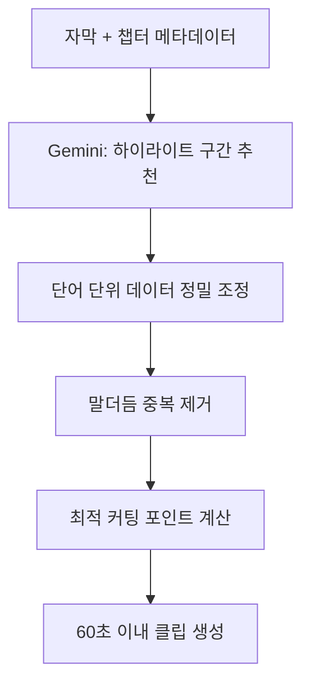
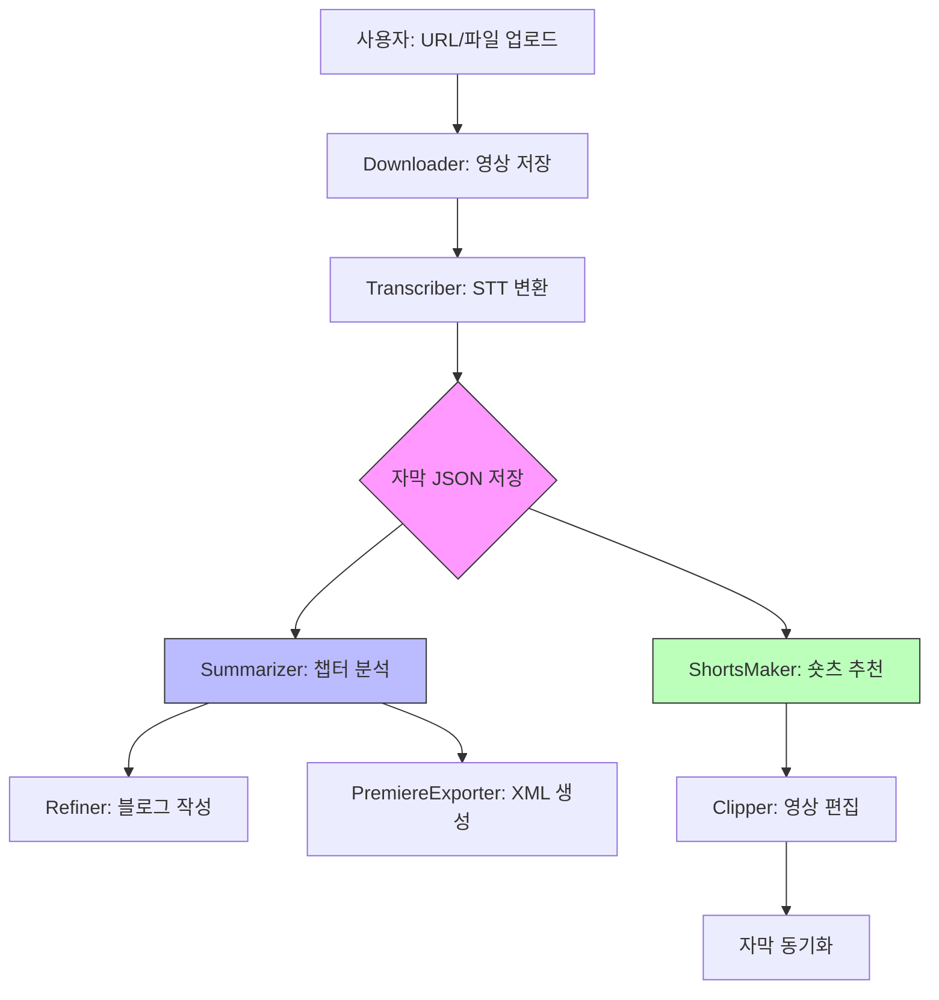

# 📊 SermonCutter AI 프로젝트 분석 보고서

## 1. 프로젝트 개요

**SermonCutter AI**는 긴 설교 영상을 AI 기술로 자동 분석하여 자막(STT), 챕터 요약, 블로그 포스팅, AI 숏츠를 생성하는 **미디어 사역 최적화 도구**입니다.

### 핵심 가치 제안
- ⏱️ **시간 절약**: 1시간 30분 영상 분석 자동화
- 🎯 **메시지 중심 편집**: AI 기반 핵심 구간 추출
- 📱 **One-Source Multi-Use**: 영상 → 자막 → 블로그 → 숏츠 자동 변환
- 🍎 **Apple Silicon 최적화**: M1/M2/M3/M4 Neural Engine 가속

---

## 2. 기술 스택 (Technology Stack)

### 2.1 백엔드 프레임워크
- **FastAPI**: 비동기 웹 서버 (Python 3.13+)
- **Uvicorn**: ASGI 서버
- **WebSocket**: 실시간 진행률 업데이트

### 2.2 AI/ML 모델

| 작업 유형 | 모델명 | 용도 |
|---------|-------|-----|
| **음성 인식 (STT)** | `mlx-whisper Large-v3 Turbo` | Apple Silicon 가속 자막 생성 |
| **영상 요약** | `Gemini 2.5 Flash` | 챕터 분석 및 구조화 |
| **블로그 기획** | `Gemini 2.5 Flash-Lite` | 콘텐츠 구조 설계 |
| **텍스트 윤문** | `Gemma 3 (27B-IT)` | 구어체 → 문어체 변환 |
| **숏츠 추출** | `Gemini 2.5 Flash` | 하이라이트 구간 선정 |

> 💡 **모델 설정**: [`data/config.json`](file:///Users/chainseok/cli/summarize_video/data/config.json)에서 실시간 변경 가능

### 2.3 미디어 처리
- **FFmpeg**: 영상/오디오 변환 및 편집
- **yt-dlp**: YouTube 영상 다운로드
- **Silero VAD**: 음성 구간 감지 (환각 제거)
- **stable-whisper**: Whisper 출력 안정화

### 2.4 주요 라이브러리
```
fastapi==0.128.0          # 웹 프레임워크
mlx-whisper==0.4.3        # Apple Silicon STT
google-genai==1.56.0      # Gemini API
torch==2.9.1              # PyTorch (VAD용)
librosa==0.11.0           # 오디오 분석
```

---

## 3. 프로젝트 구조 (Directory Structure)

```
summarize_video/
├── main.py                    # FastAPI 메인 서버 (1675 lines)
├── run.py                     # 서버 실행 스크립트
├── model_down.py              # Whisper 모델 다운로드
├── requirements.txt           # Python 의존성
├── setup.sh                   # 초기 환경 구성
├── start.sh                   # 원클릭 실행 스크립트
├── make_portable_app.sh       # macOS 앱 번들 생성
│
├── data/
│   └── config.json            # AI 모델 설정 (런타임 변경 가능)
│
├── services/                  # 핵심 비즈니스 로직 모듈
│   ├── downloader.py          # YouTube/파일 업로드 처리
│   ├── transcriber.py         # Whisper STT + VAD
│   ├── summarizer.py          # Gemini 챕터 분석
│   ├── refiner.py             # 텍스트 윤문 (Gemma)
│   ├── shorts_maker.py        # AI 숏츠 후보 생성
│   ├── clipper.py             # FFmpeg 영상 편집
│   ├── subtitle_builder.py    # SRT/VTT 자막 생성
│   ├── premiere_exporter.py   # Premiere Pro XML 출력
│   ├── task_manager.py        # 작업 상태 관리 (tasks.json)
│   ├── system_manager.py      # 설정 관리자
│   └── security.py            # API Key 보안
│
├── static/
│   ├── videos/                # 다운로드된 원본 영상
│   ├── results/               # 자막 JSON/SRT/VTT
│   ├── clips/                 # 생성된 숏츠 영상
│   ├── temp/                  # 임시 파일
│   └── assets/                # 앱 아이콘
│
├── templates/
│   └── index.html             # 웹 UI
│
└── tasks.json                 # 작업 상태 영속화 (388KB)
```

---

## 4. 핵심 기능 분석 (Core Features)

### 4.1 영상 수집 및 전처리

#### 📥 **Downloader** ([`services/downloader.py`](file:///Users/chainseok/cli/summarize_video/services/downloader.py))

**주요 기능:**
- YouTube URL 다운로드 (`yt-dlp`)
- 사용자 파일 업로드 (비동기 스트리밍)
- Safari 호환성을 위한 H.264(avc1) 코덱 우선 선택
- 파일명 정제 (특수문자 제거, 공백 → 언더스코어)

**핵심 메서드:**
```python
download_from_url(url, progress_callback, task_manager, task_id)
save_uploaded_file(upload_file, original_filename, task_manager, task_id)
```

**특징:**
- 실시간 진행률 콜백 (`_progress_hook`)
- 중단 시 임시 파일 자동 정리 (`.part`, `.ytdl`)
- 작업 취소 지원

---

### 4.2 음성 인식 (STT)

#### 🎤 **Transcriber** ([`services/transcriber.py`](file:///Users/chainseok/cli/summarize_video/services/transcriber.py))

**처리 파이프라인:**


**고급 기능:**
1. **VAD 기반 환각 제거**
   - Silero VAD로 실제 음성 구간 추출
   - Whisper 세그먼트와 교차 검증
   - 음성 없는 구간의 텍스트 자동 삭제

2. **슬라이딩 윈도우 중복 제거**
   - 긴 영상에서 발생하는 텍스트 중복 감지
   - 유사도 기반 세그먼트 병합

3. **프로세스 격리**
   - 별도 프로세스에서 Whisper 실행 (`multiprocessing`)
   - stdout 캡처로 실시간 진행률 추적
   - 메모리 누수 방지 (가비지 컬렉션)

**출력 형식:**
```json
{
  "segments": [
    {
      "id": 1,
      "start": 0.0,
      "end": 5.2,
      "text": "안녕하세요 오늘은...",
      "words": [
        {"word": "안녕하세요", "start": 0.0, "end": 0.8}
      ]
    }
  ]
}
```

---

### 4.3 AI 분석 및 요약

#### 🧠 **Summarizer** ([`services/summarizer.py`](file:///Users/chainseok/cli/summarize_video/services/summarizer.py))

**주요 작업:**

##### (1) 챕터 분석 (`summarize`)
- **입력**: 자막 세그먼트 + 영상 제목
- **출력**: 성경 구절 감지, 대지 추출, 챕터 구조화

**프롬프트 전략:**
```python
# 경량화된 스크립트 생성
"[ID:1] 안녕하세요 오늘은 요한복음 3장 16절을..."
"[ID:2] 하나님이 세상을 이처럼 사랑하사..."
```

**Gemini JSON Mode 출력:**
```json
{
  "title": "하나님의 사랑과 구원",
  "chapters": [
    {
      "title": "성경 봉독: 요한복음 3:16",
      "start_id": 1,
      "end_id": 15,
      "bible_reference": "요한복음 3:16",
      "summary": "하나님의 사랑과 독생자 예수님..."
    }
  ]
}
```

##### (2) 블로그 구조 설계 (`plan_blog_structure`)
- **모델**: Gemini 2.5 Flash-Lite (경량화)
- **역할**: 전체 영상을 주제별 섹션으로 분할
- **출력**: 챕터별 ID 범위 + 제목

##### (3) 블로그 포스트 생성 (`generate_blog_post`)
- **모델**: Gemini 2.5 Flash
- **특징**:
  - 구어체 → 문어체 변환
  - 타임스탬프 인용 (`[[ID:숫자]]` → `HH:MM:SS`)
  - 성경 구절 자동 인용

**헬퍼 클래스:**
- **`ChapterHealer`**: LLM 출력 파싱 및 타임라인 갭 자동 보정
- **`UsageTracker`**: API 토큰 사용량 추적

---

### 4.4 AI 숏츠 생성

#### ✂️ **ShortsMaker** ([`services/shorts_maker.py`](file:///Users/chainseok/cli/summarize_video/services/shorts_maker.py))

**처리 흐름:**


**핵심 메서드:**
```python
make_shorts_candidates(transcripts, video_title, chapters, focus_topic)
```

**고급 기능:**
1. **주제 기반 필터링**
   - 사용자 지정 키워드 (`focus_topic`)로 관련 챕터만 분석
   
2. **정밀 타임스탬프 조정**
   - Gemini가 제안한 시간을 단어 단위 데이터와 대조
   - 문장 중간 끊김 방지

3. **말더듬 제거**
   - 단어 간격 분석으로 중복 감지
   - 자연스러운 흐름 보장

**출력 예시:**
```json
{
  "candidates": [
    {
      "title": "하나님의 사랑",
      "start": 125.4,
      "end": 185.2,
      "duration": 59.8,
      "reason": "핵심 메시지가 감동적으로 전달됨"
    }
  ]
}
```

---

### 4.5 영상 편집

#### 🎬 **Clipper** ([`services/clipper.py`](file:///Users/chainseok/cli/summarize_video/services/clipper.py))

**주요 기능:**

##### (1) 단일 구간 자르기 (`cut_video`)
```bash
ffmpeg -ss {start} -to {end} -i input.mp4 \
  -c:v libx264 -crf 18 -preset medium \
  -pix_fmt yuv420p \  # Safari 호환성
  -af "afade=t=in:st={start}:d=0.5,afade=t=out:st={end-0.5}:d=0.5" \
  output.mp4
```

**특징:**
- **품질 유지**: CRF 18 (VBR 인코딩)
- **오디오 페이드**: 끊김 방지
- **실시간 진행률**: stderr 파싱

##### (2) 불연속 구간 병합 (`merge_segments`)
```python
segments = [
  {"start": 10, "end": 30},
  {"start": 120, "end": 150}
]
# → 하나의 연속된 영상으로 병합
```

**자막 동기화:**
- 각 구간의 자막 추출
- 타임스탬프 재계산 (0초 시작)
- SRT/VTT 병합 파일 생성

---

### 4.6 Premiere Pro 연동

#### 🎞️ **PremiereExporter** ([`services/premiere_exporter.py`](file:///Users/chainseok/cli/summarize_video/services/premiere_exporter.py))

**생성 파일:**
- **XML 타임라인**: 챕터별 컷 마커 포함
- **자막 트랙**: 줄바꿈 최적화 (최대 10자/줄, 2줄)

**편집 시간 단축:**
- AI가 나눈 챕터대로 자동 분할
- 수동 작업 80% 감소

---

### 4.7 작업 관리

#### 📋 **TaskManager** ([`services/task_manager.py`](file:///Users/chainseok/cli/summarize_video/services/task_manager.py))

**영속화 전략:**
- 작업 상태를 `tasks.json`에 저장
- 서버 재시작 시에도 복구 가능

**상태 전이:**
```
queued → processing → completed
              ↓
           canceled / failed
```

**동시성 제어:**
- `threading.Lock`으로 파일 쓰기 보호
- Atomic 파일 교체 (`.tmp` → 원본)

**취소 메커니즘:**
- `asyncio.Event` 기반 런타임 취소
- 하위 모듈에서 주기적 체크 (`is_cancelled`)

---

## 5. 데이터 흐름 (Data Flow)

### 5.1 전체 파이프라인



### 5.2 API 엔드포인트

| 엔드포인트 | 메서드 | 기능 |
|----------|-------|-----|
| `/api/transcribe` | POST | 1단계: 영상 다운로드 + STT |
| `/api/summary` | POST | 2단계: 챕터 분석 |
| `/api/blog` | POST | 블로그 포스트 생성 |
| `/api/shorts/generate` | POST | 숏츠 후보 추출 |
| `/api/clip` | POST | 단일 구간 자르기 |
| `/api/premiere/export` | POST | Premiere XML 생성 |
| `/api/tasks/{task_id}` | GET | 작업 상태 조회 |
| `/api/tasks/{task_id}/cancel` | POST | 작업 취소 |
| `/api/settings` | GET/POST | AI 모델 설정 변경 |

---

## 6. 설교 특화 기능

### 6.1 성경 구절 자동 감지
```python
# Gemini 프롬프트에 포함된 지시사항
"""
설교 중 인용되는 성경 본문(예: "요한복음 3장 16절")을 감지하여
해당 구간을 [성경 봉독] 챕터로 분류하고,
bible_reference 필드에 정확한 참조를 기록하세요.
"""
```

### 6.2 대지(Points) 추출
- "첫째", "둘째", "셋째" 등 설교 구조 인식
- 블로그 소제목으로 자동 변환

### 6.3 기도/찬양 구간 분리
- 설교 전후의 찬양, 기도 자동 감지
- 순수 설교 부분만 빠르게 편집 가능

---

## 7. 성능 최적화

### 7.1 Apple Silicon 가속
- **MLX Whisper**: Neural Engine 활용
- **GPU 가속**: Metal Performance Shaders
- **메모리 효율**: 프로세스 격리 + GC

### 7.2 비동기 처리
- **FastAPI**: 비동기 엔드포인트
- **asyncio**: FFmpeg 프로세스 비차단 실행
- **WebSocket**: 실시간 진행률 스트리밍

### 7.3 리소스 제어
```python
# main.py
resource_semaphore = asyncio.Semaphore(1)  # 동시 작업 수 제한
```

---

## 8. 보안 및 안정성

### 8.1 API Key 관리
- `.env` 파일로 환경 변수 관리
- `security.py`를 통한 중앙화된 접근

### 8.2 에러 처리
- **Tenacity**: API 호출 재시도 (지수 백오프)
- **TaskCancelledError**: 사용자 취소 예외 처리
- **파일 정리**: 중단 시 임시 파일 자동 삭제

### 8.3 데이터 무결성
- **Atomic 파일 쓰기**: 임시 파일 → 교체
- **Thread Lock**: 동시 쓰기 방지

---

## 9. 사용자 경험 (UX)

### 9.1 원클릭 실행
```bash
./start.sh  # 가상환경 자동 구축 + 서버 실행
```

### 9.2 macOS 앱 번들
```bash
./make_portable_app.sh
# → AI Video Analyst.app 생성
```

### 9.3 실시간 피드백
- 진행률 바 (0~100%)
- 단계별 상태 메시지
- WebSocket 기반 즉시 업데이트

---

## 10. 확장성 및 유지보수

### 10.1 모델 교체 용이성
```json
// data/config.json
{
  "models": {
    "summarizer": "gemini-3-flash",  // 최신 모델로 즉시 변경
    "whisper": "mlx-community/whisper-large-v3-turbo-q4"
  }
}
```

### 10.2 모듈화 설계
- 각 기능이 독립적인 클래스로 분리
- 의존성 주입 패턴 (ConfigManager)
- 테스트 코드 포함 (`if __name__ == "__main__"`)

### 10.3 향후 로드맵
- 다국어 자막 생성 (영문/중문)
- DaVinci Resolve 지원
- 설교 아카이브 검색 기능

---

## 11. 주요 기술적 도전과 해결책

### 11.1 Whisper 환각 문제
**문제**: 긴 무음 구간에서 의미 없는 텍스트 생성  
**해결**: Silero VAD + 교차 검증 필터링

### 11.2 슬라이딩 윈도우 중복
**문제**: 긴 영상에서 동일 텍스트 반복 출력  
**해결**: 유사도 기반 세그먼트 병합 (`_sanitize_segments`)

### 11.3 Safari 영상 재생 불가
**문제**: 특정 코덱 미지원  
**해결**: H.264(avc1) + yuv420p 강제 적용

### 11.4 FFmpeg 진행률 추적
**문제**: 동기 프로세스로 인한 UI 멈춤  
**해결**: 비동기 프로세스 + stderr 실시간 파싱

---

## 12. 코드 품질 지표

| 메트릭 | 값 |
|-------|---|
| **총 라인 수** | ~2,500 lines (services 제외 main.py) |
| **모듈 수** | 11개 (services 디렉토리) |
| **의존성** | 80개 패키지 |
| **Python 버전** | 3.13+ |
| **주석 비율** | ~30% (Docstring 포함) |

---

## 13. 결론

**SermonCutter AI**는 다음과 같은 특징을 가진 **프로덕션급 AI 미디어 처리 시스템**입니다:

✅ **완전 자동화**: 영상 입력 → 자막/블로그/숏츠 출력  
✅ **설교 특화**: 성경 구절 감지, 대지 추출  
✅ **Apple 최적화**: M 시리즈 칩 가속  
✅ **편집 연동**: Premiere Pro XML 지원  
✅ **확장 가능**: 모델 교체, 다국어 지원 준비  
✅ **안정성**: 작업 영속화, 취소 지원, 에러 복구  

**핵심 강점:**
- 최신 LLM 스택 (Gemini 2.5, Gemma 3) 활용
- 프로세스 격리를 통한 안정성 확보
- 실시간 진행률 추적 및 취소 기능
- 설교 도메인 특화 프롬프트 엔지니어링

**적용 분야:**
- 교회 미디어 팀 편집 워크플로우
- 온라인 사역 콘텐츠 제작
- 설교 아카이빙 및 검색 시스템

---

**Reference:**
- [Google AI Gemini Documentation](https://ai.google.dev/docs)
- [MLX Whisper GitHub](https://github.com/ml-explore/mlx-examples)
- [FFmpeg Documentation](https://ffmpeg.org/documentation.html)
- [FastAPI Documentation](https://fastapi.tiangolo.com/)
